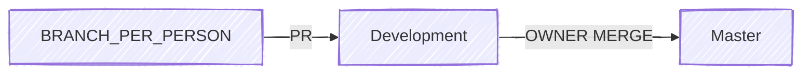

This guide defines the contribution practices to follow in this repository.

Please read it carefully before making changes, to ensure consistency and smooth collaboration.

## Branching & Workflow

- **`main`** is protected and can only be updated via **Pull Requests (PRs)**.
- Each contributor should **create a branch under their own name**: `git checkout -b yourname`
- Work is merged into **`development`** first.
- Only after validation, leads merge from **`development`** into **`main`**.

## Sync Meetings

- **Syncs** listed in `ROADMAP.md` mark the **end of a step group**.
- At each sync:
    - Contributors share results, blockers, and progress.
    - Leads give the **final validation** before moving to the next stage.

## Packaging & MONAI Bundles

- For the **final packaging step**, follow the **MONAI Bundle specification** as much as possible:
    
    👉 [MONAI Bundle Specification](https://docs.monai.io/en/latest/mb_specification.html)
    
- The bundle should include:
    - Model definition & weights
    - Training / inference configuration
    - Documentation (`README.md`)

## README.md Guidelines

- Base your `README.md` on the **MONAI Model Zoo template**.
- In the **Authors** section, always include: Firstname Lastname (@github_username)

## API Endpoints

- Each model should expose an **inference endpoint**: `/medical-imaging-ai/[model_name]`
- Input → processed by model → Output (described in the model’s `README.md`).
- Implementation should rely on:
    - **FastAPI**
    - **Pydantic** (typing)
    - **Swagger/OpenAPI docs**
    - **Dockerized packaging**

## General Practices

- Write **clear commit messages** ([Commitizen](https://commitizen-tools.github.io/commitizen/) is recommended):
- Document preprocessing choices in `README.md`.
- Keep contributions **small, modular, and testable**.
- Ask for feedback early via PRs.
