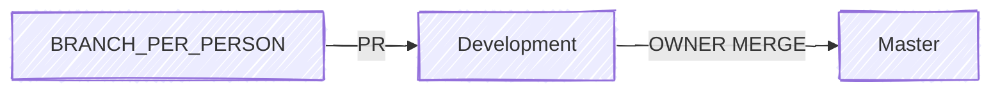

### Team

##### **Patricia**

^141556

Machine Learning ( Lead )
##### **Shriya**

^192ebb

Boston MIT Machine Learning ( Lead )
##### **Asmaa**

^b46694

Ingénieurie DATA
##### **Shane**

^f18ce9

Doctor ( appel à des médécins et des maths)
##### **Duncan**

^eb4e0c

Machine Learning ( Lead )
###### **Govind**

^7c70c0

Reviewing

##### **Kunal**

^348a3c

Nvidia Formation

## Objectifs et Expected Outputs

**Sensibilité** > 0,9

## Steps

### 1. Get data

##### 1.1  From [Public Datasets ( MONAI, Kaggle, INBreast )](https://docs.google.com/spreadsheets/d/1-1IvO2kFGPnquefa9rqXMLiJvNajsqybzYZNq5MkMFo/edit?gid=0#gid=0)

### 2. Exploration de la data

##### 2.1 Shape of data ( cb photos avec tumeur < cb photos sans tumeur )

##### 2.2 Information about data

### 3.  Preprocessing de la data

##### 3.1 Manage Unbalanced

#### 3.2 Sync ( September 30th, 2025 ) 
[[Detection#^141556|Patricia]]
[[Detection#^f18ce9|Shane]] Participation réunion avec retour des infos
[[Detection#^b46694|Asmaa]]
[[Detection#^eb4e0c|Duncan]] ?
### 4. Model Training

#### 4.1 Model Selection computer vision for detection ( YOLO, Faster RCNN ... )

#### 4.3 Sync ( October 7th, 2025 )
[[Detection#^141556|Patricia]]
[[Detection#^b46694|Asmaa]]
[[Detection#^eb4e0c|Duncan]]
[[Detection#^192ebb|Shriya]]
[[Detection#^348a3c|Kunal]]
### 5. Finetuner

#### 6. Évaluation & validation

#### 6.1 Choix de la metrics ( ROC-AUC,  FROC ...)

#### 6.2 Si Possible info ( localisation tumeur, age, sex, [[Density]] .... )  

#### 6.1 Sync ( October 17th, 2025 )
[[Detection#^141556|Patricia]]
[[Detection#^eb4e0c|Duncan]]
[[Detection#^192ebb|Shriya]]
[[Detection#^348a3c|Kunal]]
#### 7. Final Packaging ( MONAI based )

##### 7.1 API endpoint Création 
	- FastAPI ?
	- Pydantic ( typing )
	- Swagger
	- Docker
	- README
##### 7.2 Sync ( October 24th, 2025 )
[[Detection#^141556|Patricia]] ?
[[Detection#^348a3c|Kunal]]
[[Detection#^b46694|Asmaa]]
[[Detection#^7c70c0|Govind]]
### ( Optionnal )
#### 8. DICOM protocol and acquisition

##### 8.1 Anonymize data ( RGPD, HDS ... )

### Convention de Commit

use commitizen if wanted.

<type>(<scope>): <Description courte>
<Breakline>
	<Description longue: Explication, motivation ...>
<Breakline>
